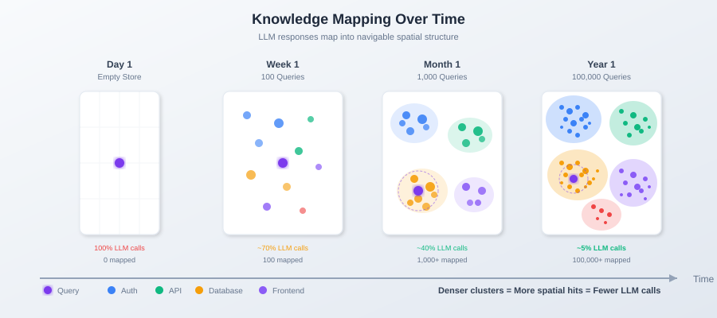

<!--
Copyright 2025-2026 Adolfo Lopez (ch1pu)
SPDX-License-Identifier: Apache-2.0

Author: Adolfo Lopez (ch1pu) - github.com/ch1pu
Project: INFINATE - Infinite Context Spatial AI (github.com/ch1pu/infinate)
-->

# Mapping LLMs: Building Context Through Spatial Storage

**Author:** Adolfo Lopez (ch1pu)
**Date:** January 29, 2026
**Status:** M2.0 Planning Document (Ideas & Architecture)

> **Note:** This document describes planned functionality for **Milestone 2.0: LLM Integration**. The concepts here build on INFINATE's existing spatial infrastructure (M1.1-M1.11) but are not yet implemented. This serves as architectural planning and vision documentation.

---

## Abstract

INFINATE's Spatial Semantic Store provides a way to **store and retrieve LLM outputs** efficiently. When connected to an LLM, the spatial structure captures and organizes responses for future context retrieval. Over time, this builds a rich context library that can be queried in O(k) time.

**Mapping LLMs** = storing LLM outputs in spatial positions for efficient future retrieval.

The result: **richer context** for LLM queries, with O(k) retrieval regardless of how much knowledge has been stored.

---

## 1. The Traditional Problem

### 1.1 RAG: Retrieval-Augmented Generation

```
Traditional RAG Pipeline:
┌──────────┐    ┌─────────┐    ┌─────────┐    ┌──────────┐
│ Question │ →  │ Retrieve│ →  │   LLM   │ →  │  Answer  │
└──────────┘    │  Docs   │    │ Generate│    └──────────┘
                └─────────┘    └─────────┘
                     ↑
              Static Document Store
```

**Limitations:**
- Documents must exist before queries
- Previous LLM responses aren't captured for reuse
- Context retrieval is O(n) or O(n log n)
- No way to build on prior conversations

### 1.2 The Context Problem

Each LLM query starts fresh. Previous responses that could provide useful context are lost. If you asked about authentication yesterday, that context isn't available today.

---

## 2. The INFINATE Approach: Spatial Context Storage

### 2.1 Core Concept

```
INFINATE + LLM Pipeline:
┌──────────┐    ┌─────────────┐    ┌─────────┐    ┌──────────┐
│ Question │ →  │ Spatial     │ →  │   LLM   │ →  │  Answer  │
└──────────┘    │ Context     │    │ Reasons │    └────┬─────┘
                │ Retrieval   │    └─────────┘         │
                └──────┬──────┘         ↑              │
                       │                │              │
                       │          Context              │
                       ↓                               ↓
              ┌─────────────────────────────────────────┐
              │         Spatial Semantic Store          │
              │  (Context stored here for retrieval)    │
              └─────────────────────────────────────────┘
```

**Key difference:** LLM outputs are stored spatially for future context retrieval. The LLM always does the reasoning.

### 2.2 How It Would Work (Conceptual)

*Note: This describes the planned integration (M2.0+), not current implementation.*

**The Context-Store Loop:**

1. **Query comes in** - user asks a question
2. **Retrieve spatial context** - find related stored knowledge in O(k)
3. **Send to LLM with context** - LLM receives query + retrieved context
4. **LLM generates answer** - LLM does the reasoning
5. **Store the response** - map LLM output to spatial position for future context

The LLM always reasons. INFINATE provides richer context through efficient retrieval.

*Implementation details: see `unreleased/m2_llm_mapping_concepts.py`*

### 2.3 The Compounding Context Effect

```
Time 0: Empty spatial store
        └── LLM queries have no prior context

Time 1: After 100 queries
        └── 100 stored responses
        └── New queries can retrieve related prior responses as context

Time 2: After 1,000 queries
        └── 1,000+ stored responses
        └── Dense context available for most topics
        └── LLM gets richer context, gives better answers

Time 3: After 10,000 queries
        └── Rich context library
        └── Almost any query has relevant prior context
        └── LLM benefits from accumulated knowledge
```

---

## 3. Why Spatial Structure Enables This

### 3.1 Auto-Organization

When an LLM response is embedded and positioned:

```
LLM Response: "JWT tokens use base64 encoding for the header..."
                              ↓
                        Embedding
                              ↓
                    Position: (auth_region, recent, implementation)
                              ↓
              Stored near: [OAuth, Session, Security, Tokens]
```

The response **finds its neighborhood** without manual categorization.

### 3.2 Compound Context

Future queries about authentication now have context available:

```
Query: "How do I refresh an expired token?"
                    ↓
        Spatial retrieval finds:
        - JWT token explanation (previous LLM response)
        - OAuth flow documentation
        - Session management code
                    ↓
        LLM receives query + rich context
                    ↓
        LLM gives better answer (it has more to work with)
                    ↓
        Better answer stored, enriches future context
```

**Context compounds.** Each stored response improves future context retrieval.

### 3.3 The O(k) Advantage

Traditional context retrieval: Search all stored knowledge → O(n)
Spatial retrieval: Look up nearby positions → O(k)

As stored knowledge grows from 1,000 to 1,000,000 items:
- Traditional: 1000× slower retrieval
- Spatial: Same speed (only examine k neighbors)

**Context retrieval scales infinitely** because lookup cost is constant.

---

## 4. Visualization



*The spatial map grows denser with each LLM interaction. Clusters form around frequently-discussed topics. Denser regions provide richer context for related queries.*

---

## 5. Practical Implications

### 5.1 Better Context, Better Answers

| Context Available | LLM Answer Quality |
|-------------------|-------------------|
| None | Generic, may miss nuances |
| Some related docs | Better, more specific |
| Rich prior conversation history | Best, builds on prior knowledge |

INFINATE enables the third option at O(k) cost.

### 5.2 Retrieval Speed

| Operation | Latency |
|-----------|---------|
| Traditional retrieval (O(n)) | 10-100ms at scale |
| Spatial retrieval (O(k)) | 0.1-1ms constant |

Faster context retrieval means faster time-to-first-token for LLM responses.

### 5.3 Context Quality

Spatial organization provides naturally relevant context:

1. **Semantic proximity**: Retrieved context is semantically related
2. **Temporal awareness**: Recent responses can be weighted higher
3. **Topic clustering**: Related concepts are stored together
4. **No manual tagging**: Organization emerges from embeddings

---

## 6. The "Mapping LLMs" Mental Model

Think of it as building a library:

```
┌─────────────────────────────────────────────────────────┐
│                                                         │
│                    LLM (The Expert)                     │
│                                                         │
│    Reasons, generates answers, needs good context       │
│                                                         │
└────────────────────────┬────────────────────────────────┘
                         │
                    Answers flow down
                    Context flows up
                         │
                         ↓
┌─────────────────────────────────────────────────────────┐
│                                                         │
│              Spatial Semantic Store                     │
│              (The Library)                              │
│                                                         │
│    Stores past responses, retrieves relevant context    │
│                                                         │
└─────────────────────────────────────────────────────────┘
```

**The LLM is the expert. The spatial store is the library.**

A well-organized library helps the expert give better answers. The expert still does the thinking.

---

## 7. Relationship to Skill Packs

This storage concept enables **Skill Packs**:

```
Skill Pack = Pre-built context library for a domain

"Python Expert" Skill Pack:
├── 50,000 stored Python Q&A pairs
├── Spatially organized by topic
├── Instantly loadable into any INFINATE instance
└── Rich context available immediately
```

Skill Packs are essentially **pre-built context libraries** ready to load.

---

## 8. Implementation Considerations (M2.0+ Planning)

### 8.1 When to Store

Not every LLM response should be stored:

| Response Type | Store? | Reason |
|--------------|--------|--------|
| Factual explanations | ✅ Yes | Useful future context |
| Code examples | ✅ Yes | High reuse value |
| Personalized advice | ⚠️ Maybe | Context-dependent |
| One-time calculations | ❌ No | Not useful as context |
| Conversational filler | ❌ No | No context value |

### 8.2 Staleness Management

Stored knowledge can become stale. The refresh strategy should consider:

- **Domain volatility** - Math/physics stay relevant; news/APIs go stale quickly
- **Age of content** - Older entries may need updating
- **Retrieval patterns** - Frequently retrieved content gets validated more often

### 8.3 Context Selection

When retrieving context for a query:

| Retrieved Items | Action |
|-----------------|--------|
| Highly relevant (close) | Include as primary context |
| Somewhat relevant (medium) | Include as secondary context |
| Weakly relevant (far) | Exclude to avoid noise |

*Implementation details: see `unreleased/m2_llm_mapping_concepts.py`*

---

## 9. Summary

> **Reminder:** This is M2.0 planning. The spatial infrastructure exists (M1.1-M1.11). LLM integration is the next major milestone.

**The Insight:**
INFINATE's spatial structure provides O(k) context retrieval for LLM queries. By storing LLM outputs spatially, we build a growing context library that makes future queries richer.

**The Mechanism (Planned for M2.0):**
1. LLM generates response
2. Response is stored at spatial position based on embedding
3. Future queries retrieve relevant stored responses as context
4. LLM receives richer context, gives better answers

**The Expected Result:**
- O(k) context retrieval regardless of library size
- Richer context leads to better LLM answers
- Context compounds over time
- Foundation for pre-built Skill Packs (context libraries)

**The Mental Model:**
The LLM is the expert. INFINATE is the library. A good library helps the expert give better answers.

**Current Status:**
- ✅ Spatial infrastructure ready (M1.1-M1.11 complete)
- ⏳ LLM integration planned (M2.0)
- 📋 This document serves as architectural planning

---

## References

- INFINATE Spatial Semantic Store: `Documents/SPATIAL_SEMANTIC_STORE.md`
- Core Innovation (O(k) Complexity): `Documents/CORE_INNOVATION.md`
- Spatial Model Architecture: `Documents/SPATIAL_MODEL_ARCHITECTURE.md`

---

*Document created: January 29, 2026*
*Author: Adolfo Lopez (ch1pu)*
