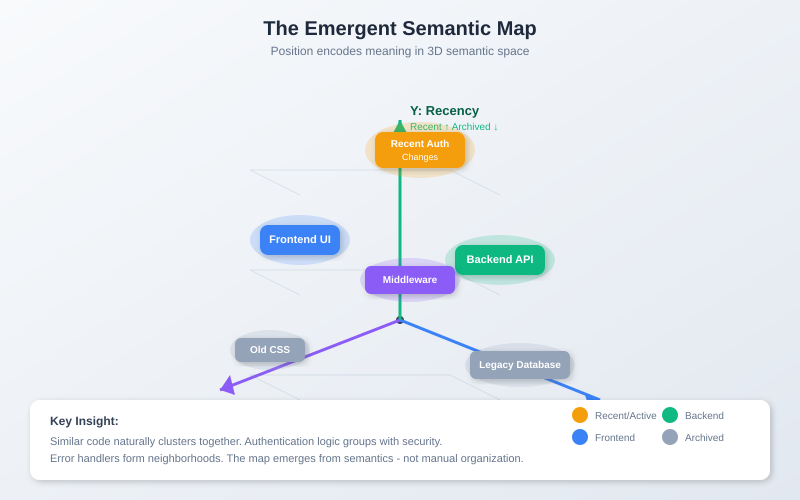

<!--
Copyright 2025-2026 Adolfo Lopez (ch1pu)
SPDX-License-Identifier: Apache-2.0

Author: Adolfo Lopez (ch1pu) - github.com/ch1pu
Project: INFINATE - Infinite Context Spatial AI (github.com/ch1pu/infinate)
-->

# The Spatial Semantic Store: A Novel Data Structure

**Author:** Adolfo Lopez (ch1pu)
**Date:** January 29, 2026
**Status:** Technical Specification

---

## Abstract

INFINATE introduces a fundamentally new data structure: the **Spatial Semantic Store**. Unlike traditional vector databases that store embeddings as flat lists requiring exhaustive search, the Spatial Semantic Store maps data to 3D coordinates where **position encodes meaning**. This organization creates an emergent semantic landscape where similar concepts cluster spatially, enabling O(k) constant-time queries as a natural consequence of the structure itself.

The innovation is not primarily algorithmic—it's architectural. The data structure does the work at write time, making read-time queries trivial.

---

## 1. The Problem with Traditional Vector Stores

### 1.1 How Vector Databases Work Today

```
Traditional Pipeline:
┌─────────┐    ┌───────────┐    ┌─────────────┐
│  Data   │ →  │ Embedding │ →  │ Flat Store  │
└─────────┘    └───────────┘    └─────────────┘
                                      ↓
                               [vec1, vec2, vec3, ... vecN]
```

**At query time:**
1. Convert query to embedding
2. Compare against ALL stored vectors
3. Return top-k by similarity
4. Complexity: O(n) minimum, often O(n log n) with indexing

### 1.2 The Fundamental Limitation

Even with sophisticated indexing (HNSW, IVF, etc.), vector stores treat embeddings as **points in abstract space** without inherent organization. The vectors exist, but they don't *know* about each other.

**Consequence:** Every query must search broadly because the store has no concept of "nearby" at the semantic level.

---

## 2. The Spatial Semantic Store

### 2.1 Core Innovation: Position = Meaning

```
INFINATE Pipeline:
┌─────────┐    ┌───────────┐    ┌──────────────┐    ┌─────────────────┐
│  Data   │ →  │ Embedding │ →  │ Dimensionality│ →  │ Spatial Store   │
└─────────┘    └───────────┘    │  Reduction    │    │ (3D Coordinates)│
                                └──────────────┘    └─────────────────┘
                                                            ↓
                                                    Semantic Landscape
```

**The key transformation:** High-dimensional embeddings (768D, 1536D) are mapped to 3D spatial coordinates where:

- **X-axis:** Semantic category (frontend ↔ backend, UI ↔ infrastructure)
- **Y-axis:** Recency/importance (recent/active ↑, archived ↓)
- **Z-axis:** Abstraction level (implementation ↔ interface)

### 2.2 The Emergent Map

When data is stored this way, structure emerges:



*3D visualization showing semantic space with X (Category: Frontend ↔ Backend), Y (Recency: Recent ↑ Archived ↓), and Z (Abstraction: Interface ↔ Implementation) axes.*

**Critical insight:** Similar code naturally clusters. Authentication logic groups together. Error handlers form neighborhoods. The map *emerges* from the semantics—it's not manually organized.

### 2.3 Why Queries Become O(k)

With data organized spatially:

```
Query: "How does authentication work?"

Traditional:  Search all N vectors → O(n)

Spatial:      1. Map query to position (auth region)
              2. Look at k nearest neighbors
              3. Return nearby chunks → O(k)
```

**The spatial organization means "relevant" and "nearby" are the same thing.**

The query doesn't search—it *navigates* to the right region and looks around.

---

## 3. Technical Architecture

### 3.1 Write Path (Indexing)

```python
def store_chunk(content: str, metadata: dict) -> SpatialToken:
    # 1. Generate semantic embedding
    embedding = encoder.encode(content)  # 768D vector

    # 2. Map to 3D position (the key innovation)
    position = dimensional_reduction(embedding)  # → (x, y, z)

    # 3. Store with spatial index
    token = SpatialToken(
        content=content,
        embedding=embedding,
        position=position,
        metadata=metadata
    )

    # 4. Insert into octree for O(log n) spatial lookup
    octree.insert(token)

    return token
```

**Write complexity:** O(log n) for octree insertion
**But this is amortized:** Data is written once, queried many times

### 3.2 Read Path (Query)

```python
def query(question: str, k: int = 50) -> List[SpatialToken]:
    # 1. Map query to position
    query_embedding = encoder.encode(question)
    query_position = dimensional_reduction(query_embedding)

    # 2. Spatial lookup (NOT similarity search)
    nearby_tokens = octree.query_radius(
        center=query_position,
        radius=attention_radius,
        max_results=k
    )

    # 3. Return spatially close chunks
    return nearby_tokens
```

**Read complexity:** O(k) - only examine k neighbors, regardless of total data size

### 3.3 The Octree Spatial Index

```
Octree Structure:
                    ┌───────────────────┐
                    │    Root Node      │
                    │   (entire space)  │
                    └─────────┬─────────┘
                              │
            ┌─────────────────┼─────────────────┐
            ↓                 ↓                 ↓
      ┌──────────┐     ┌──────────┐     ┌──────────┐
      │ Octant 1 │     │ Octant 2 │     │ Octant 3 │ ...
      │ (Auth)   │     │ (API)    │     │ (DB)     │
      └────┬─────┘     └──────────┘     └──────────┘
           │
     ┌─────┼─────┐
     ↓     ↓     ↓
   [tokens clustered by semantic similarity]
```

**Octree properties:**
- O(log n) insertion
- O(k) range query (independent of n)
- Natural clustering preserves semantic neighborhoods

---

## 4. Comparison with Existing Approaches

### 4.1 Vector Database Comparison

| Feature | Traditional VectorDB | Spatial Semantic Store |
|---------|---------------------|------------------------|
| Storage | Flat embedding list | 3D spatial coordinates |
| Organization | None (or approximate) | Semantic = Spatial |
| Query method | Similarity search | Spatial navigation |
| Complexity | O(n) or O(n log n) | O(k) constant |
| Scalability | Degrades with size | Constant regardless |

### 4.2 Why This Wasn't Done Before

1. **Dimensionality reduction was expensive:** Real-time UMAP/t-SNE wasn't practical
2. **Embeddings were the goal:** Researchers focused on better vectors, not better organization
3. **Gaming insight was missing:** The "infinite map hack" comes from video games, not ML

### 4.3 The Video Game Insight

Modern games handle infinite worlds through:
- **Level of Detail (LOD):** Near = detailed, far = compressed
- **Spatial chunking:** Only load what's nearby
- **Streaming:** Dynamic load/unload based on position

INFINATE applies these principles to semantic data:
- **Semantic LOD:** Near concepts = full detail, far = summarized
- **Attention radius:** Only attend to k nearby tokens
- **Context streaming:** Load/unload based on query position

---

## 5. The Emergent Properties

### 5.1 Self-Organizing Knowledge

When data is stored spatially by meaning:

```
Input: Random code chunks from a codebase

After spatial indexing:
┌─────────────────────────────────────────────┐
│                                             │
│   [Auth]────[Session]────[JWT]              │
│      │          │          │                │
│      └────[Middleware]─────┘                │
│                │                            │
│           [API Routes]                      │
│                │                            │
│      ┌─────────┴─────────┐                  │
│   [Users]            [Products]             │
│      │                   │                  │
│   [Database]────────[Queries]               │
│                                             │
└─────────────────────────────────────────────┘
```

**The structure emerges from semantics.** Related code finds each other.

### 5.2 Queries Become Local Lookups

Traditional vector search:
```
Query → Compare to ALL vectors → Sort → Return top-k
```

Spatial Semantic Store:
```
Query → Map to position → Look at nearby positions → Return neighbors
```

**The spatial organization transforms global search into local lookup.** Instead of comparing against everything, you only examine what's nearby—because "nearby" and "relevant" mean the same thing in semantic space.

### 5.3 Multi-Scale Context

The spatial organization enables hierarchical views:

| Distance | What You See | Token Detail |
|----------|--------------|--------------|
| Near (0-50) | Immediate context | Full content |
| Medium (50-150) | Related concepts | Summaries |
| Far (150-500) | Distant topics | Keywords only |
| Beyond (500+) | Other domains | Existence only |

This is the LOD system (M1.10) - a natural consequence of spatial organization.

---

## 6. Implications

### 6.1 For AI Systems

- **Unlimited context:** Navigate infinite data, load k at a time
- **Constant cost:** Query 1M tokens or 1B tokens, same compute
- **Transparent reasoning:** Watch the AI navigate semantic space

### 6.2 For Knowledge Management

- **Self-organizing archives:** Documents find their place
- **Emergent connections:** Related knowledge clusters naturally
- **Intuitive exploration:** Browse knowledge like exploring a world

### 6.3 For Database Design

- **New indexing paradigm:** Semantic coordinates, not just keys
- **Spatial queries on meaning:** "Find everything near this concept"
- **Hybrid possibilities:** Combine with traditional indices

---

## 7. Summary

The Spatial Semantic Store is a novel data structure where:

1. **Data is mapped to 3D coordinates based on meaning**
2. **Similar concepts become spatial neighbors**
3. **An emergent semantic landscape forms automatically**
4. **Queries navigate rather than search**
5. **O(k) complexity is a natural consequence of the structure**

The innovation is not the query algorithm—it's the organization. By doing the hard work at write time (mapping meaning to position), read time becomes trivial (look nearby).

**The data structure IS the breakthrough.**

---

## References

- INFINATE Core Innovation: `Documents/CORE_INNOVATION.md`
- Spatial Model Architecture: `Documents/SPATIAL_MODEL_ARCHITECTURE.md`
- Hierarchical LOD System: `docs/milestones/milestone-1.10-hierarchical-lod.md`
- Strafe Jumping Navigation: `Project/MILESTONE_1.11_COMPLETE.md`

---

*Document created: January 29, 2026*
*Author: Adolfo Lopez (ch1pu)*
