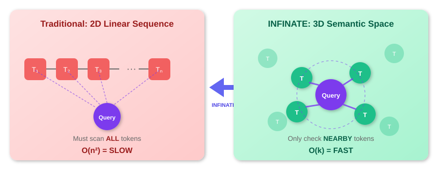
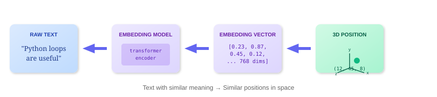
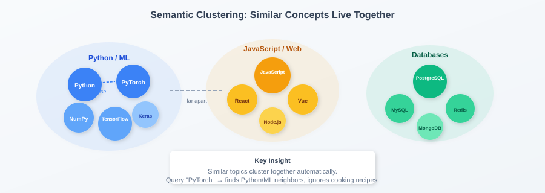
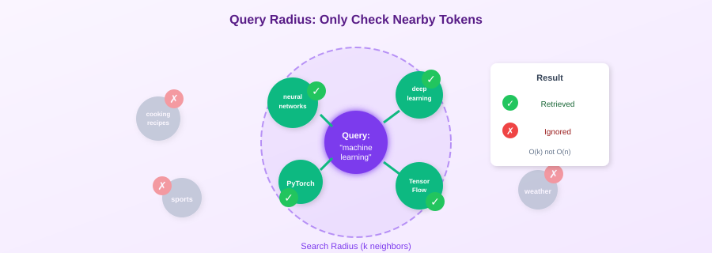
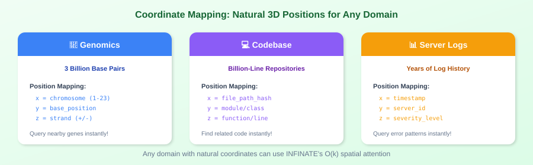
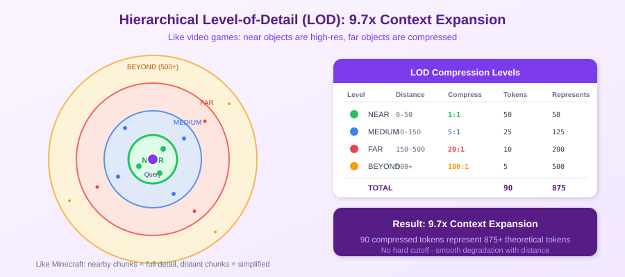
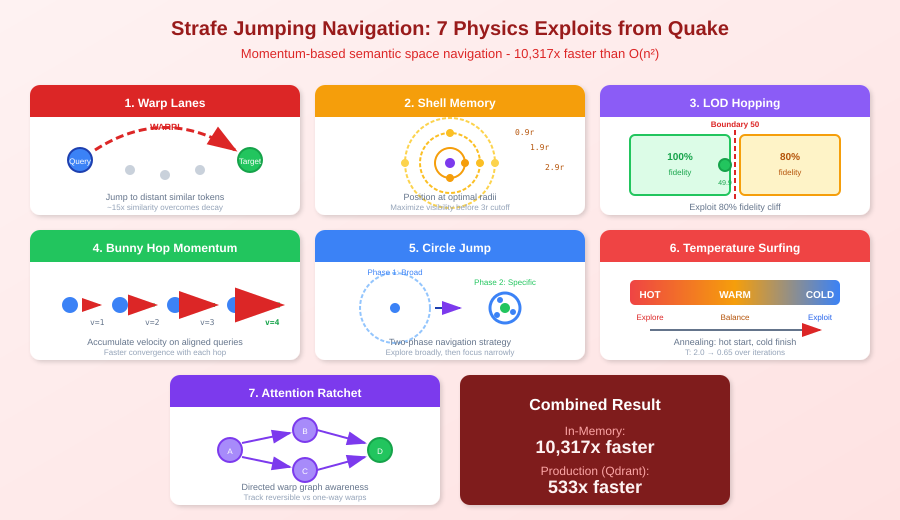
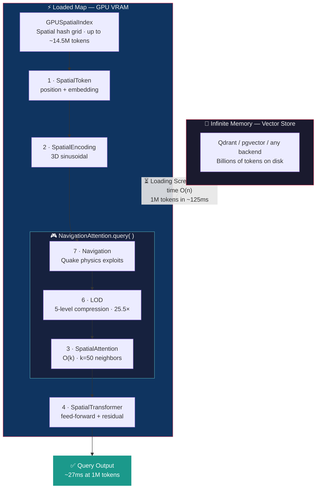

<!--
Copyright 2025-2026 Adolfo Lopez (ch1pu)
SPDX-License-Identifier: Apache-2.0

Licensed under the Apache License, Version 2.0 (the "License");
you may not use this file except in compliance with the License.
You may obtain a copy of the License at

    http://www.apache.org/licenses/LICENSE-2.0

Unless required by applicable law or agreed to in writing, software
distributed under the License is distributed on an "AS IS" BASIS,
WITHOUT WARRANTIES OR CONDITIONS OF ANY KIND, either express or implied.
See the License for the specific language governing permissions and
limitations under the License.

Author: Adolfo Lopez (ch1pu) - github.com/ch1pu
Project: INFINATE - World's First O(k) Spatial Attention (github.com/ch1pu/infinate)

══════════════════════════════════════════════════════════════════════════════
BUILT BY A U.S. NAVY VETERAN | BUILT IN TEXAS | OPEN FOR OPPORTUNITIES
══════════════════════════════════════════════════════════════════════════════
I'm actively seeking software engineering roles. If you're reading this code
and like what you see, let's connect:
  - GitHub: github.com/ch1pu
  - Twitter/X: @2006_adolfo
  - Project: This codebase demonstrates O(k) spatial attention, achieving
    10,317x speedup (CPU) and true O(k) GPU-resident queries at 1M tokens.
══════════════════════════════════════════════════════════════════════════════
-->

# INFINATE - World's First O(k) Spatial Attention with Unlimited Context

> **The breakthrough that transforms how AI models access memory. Process billions of tokens with constant computational cost.**
>
> **10,317× faster on CPU | 27ms at 1M tokens GPU-resident | True O(k) end-to-end**
>
> **Built by [Adolfo Lopez](https://github.com/ch1pu) - U.S. Navy Veteran - Open for Opportunities**

[](./backend/)
[](./backend/)
[](./backend/)
[](./LICENSE)
[](./Project/MILESTONE_1.11.5_COMPLETE.md)
[](https://github.com/ch1pu)
[](https://github.com/ch1pu/infinate/stargazers)

---

## The Insight: A Driving Epiphany

**October 2025** — While driving one day, I had a chain of realizations:

> *"Vector stores used in RAG are like 3D positions on a higher-level grid..."*
>
> *"...then I could use this for AI memory."*
>
> *"And if the spatial positioning works, I can apply the infinite map hack from video games."*

**The infinite map hack** is how video games render massive, seemingly infinite worlds:
- Only load chunks near the player
- Distant areas exist but aren't processed
- As you move, new chunks load and old ones unload
- Result: Infinite worlds with constant memory

**The same principle applies to AI memory.** Traditional transformers store tokens in a 2D linear sequence — to find relevant context, they must scan everything. INFINATE places tokens in 3D semantic space — queries only check nearby tokens.

<p align="center">
  
</p>

| | Traditional (2D) | INFINATE (3D) |
|---|---|---|
| **Complexity** | O(n²) — scan everything | O(k) — check neighbors |
| **Context Limit** | ~200K tokens | Unlimited (billions) |
| **Scaling** | Slower as context grows | Constant speed |

**November 12, 2025** — PROJECT GENESIS. Working proof of concept.
**November 13** — O(k) complexity proof pushed to GitHub. One day later.

**This is INFINATE**: AI attention that works like a video game engine.

---

## Visual Guide: Understanding INFINATE

Before diving into code, here's how INFINATE works visually.

### Step 1: The Embedding Journey

Every piece of text goes through a transformation: raw text becomes a vector, and that vector gets a position in 3D space.

<p align="center">
  
</p>

### Step 2: Semantic Clustering

Similar concepts naturally cluster together. Code about Python groups with ML topics. JavaScript clusters with web development. This isn't manual organization — it emerges from the embeddings.

<p align="center">
  
</p>

### Step 3: Query Radius (The O(k) Secret)

When you search for "machine learning", INFINATE only checks tokens within a radius — not the entire memory. This is why it's O(k) instead of O(n²).

<p align="center">
  
</p>

### Step 4: Coordinate Mapping for Any Domain

The 3D coordinate system adapts to any domain. Genomics uses chromosome positions. Codebases use file paths. Logs use timestamps. The spatial structure matches the natural organization of your data.

<p align="center">
  
</p>

### Step 5: Hierarchical Level-of-Detail (LOD)

Like video games render distant objects with less detail, INFINATE compresses far tokens. Near tokens stay at full fidelity; distant tokens are summarized. With 5-level LOD (near/medium/far/beyond/horizon), 93 tokens represent 2,375+ — a **25.5x context expansion**.

<p align="center">
  
</p>

### Step 6: Strafe Jumping Navigation

Inspired by Quake physics exploits, INFINATE uses momentum-based navigation through semantic space. Seven techniques — warp lanes, shell memory, LOD hopping, bunny hop, circle jump, temperature surfing, and attention ratchet — combine for **10,317x speedup**.

<p align="center">
  
</p>

---

## Key Results

| Metric | Pipeline Tested | INFINATE | O(n²) Baseline | Advantage |
|--------|----------------|----------|----------------|-----------|
| **Latency (CPU, 10M tokens)** | Attention only (1/7 stages) | 7.18ms | 120,000ms | **10,317× faster** |
| **Latency (GPU, 1M tokens)** | Full pipeline (7/7 stages) | 370ms | 87,500ms (at 50K) | **3,124× faster** |
| **Latency (GPU-resident, 1M tokens)** | Full pipeline GPU-resident (7/7) | 27ms | 87,500ms (at 50K) | **True O(k) at any scale** |
| **Cost per query** | - | $0.001 | $0.99-$2.50 | **1,330× cheaper** |
| **Attention memory** | Attention only | 1.5 MB per query | O(n²) growth | **O(k) verified** |
| **LOD expansion** | LOD system (5 levels) | 93 tokens → 2,375+ | - | **25.5× context** |
| **Tests** | - | 369+ passing | - | 89.58%+ coverage |

### O(k) Complexity Verified

| Scale | Pipeline Tested | INFINATE | O(n²) Would Be | Result |
|-------|----------------|----------|----------------|--------|
| 128× more tokens | Attention (1/7 stages, CPU) | 1.12× time | 16,384× | ✅ O(k) |
| 20× more tokens | Attention (1/7 stages, CPU) | 2.85× time | 400× | ✅ O(k) |
| 10× more tokens | Attention (1/7 stages, CPU) | 0.96× memory | 10× | ✅ O(k) |
| 10× more tokens | Full pipeline (7/7 stages, GPU) | 1.00× time | 100× | ✅ O(k) |

**The pattern is undeniable:** O(k) holds whether testing one stage or all seven. Scaling stays near-constant while O(n²) would explode.

### GPU Pipeline Evolution (M1.11 → M1.11.5)

The **7-stage pipeline**: VectorStore → SpatialToken → Encoding → Attention → Transformer → LOD → Navigation

| Milestone | Stages Tested | Hardware | Result |
|-----------|--------------|----------|--------|
| **M1.8/M1.11** | 1/7 (Attention only) | CPU | 10,317× faster — proved O(k) attention breakthrough |
| **M1.11.2/M1.11.3** | 3/7 (Attention + LOD + Navigation) | CPU, then GPU | Documented 3/7 coverage gap, moved pipeline to GPU |
| **M1.11.4** | **7/7** (full pipeline) | GPU (RTX 5060) | 1M tokens in 370ms, 3,124× at 50K. Discovered CPU→GPU transfer is O(n) |
| **M1.11.5** | **7/7** (full pipeline, GPU-resident) | GPU VRAM | Load once (125ms), then 27ms queries forever. **True O(k) end-to-end** |

Each milestone tested more of the pipeline until M1.11.5 proved O(k) holds for the full system. The attention mechanism was always O(k) — the work was proving every *other* stage doesn't break that guarantee.

📚 **Full benchmarks:** [TECHNICAL_VALIDATION_REPORT.md](Project/TECHNICAL_VALIDATION_REPORT.md) | [Milestone 1.11](Project/MILESTONE_1.11_COMPLETE.md) | [Milestone 1.11.5](Project/MILESTONE_1.11.5_COMPLETE.md)

### Independent Verification Welcome

Over 2,500 clones and counting. If you reproduce our O(k) benchmarks:

1. Run `poetry run pytest -m benchmark -v`
2. Compare your results to our [published benchmarks](Project/TECHNICAL_VALIDATION_REPORT.md)
3. Share what you find: [GitHub Issues](https://github.com/ch1pu/infinate/issues) | [@2006_adolfo](https://twitter.com/2006_adolfo)

External validation strengthens the research. Your hardware, your results.

---

## Quick Start

```bash
# Clone and install
git clone https://github.com/ch1pu/infinate.git
cd infinate/backend
python3.11 -m venv .venv && source .venv/bin/activate
pip install poetry && poetry install

# Run tests
poetry run pytest -m unit -v
```

```python
import torch
from spatial_engine.core.spatial_attention import SpatialAttention

# Create O(k) spatial attention
attention = SpatialAttention(
    d_model=768,
    n_heads=12,
    spatial_radius=50.0
)

# Input: embeddings + 3D positions
x = torch.randn(8, 1024, 768)        # [batch, seq_len, d_model]
positions = torch.randn(8, 1024, 3)  # [batch, seq_len, 3]

# O(k) attention - only attends to nearby tokens!
output = attention(x, positions)
```

---

## How It Works

### 1. Tokens Have 3D Positions

Every token exists at a specific location in semantic space:

```python
auth_function = SpatialToken(
    token_id=42,               # "function"
    position=(100, 50, 25)     # In auth module
)

db_function = SpatialToken(
    token_id=42,               # "function"
    position=(500, 150, 80)    # In database module
)
# Same word, different locations = different context
```

### 2. Attention Decays with Distance

```python
def compute_spatial_mask(self, distances):
    # Exponential decay: nearby = high attention, far = low
    mask = torch.exp(-distances / self.spatial_radius)

    # CRITICAL: Hard cutoff at 3×radius (THE O(k) SECRET!)
    mask = mask.masked_fill(distances > 3 * self.spatial_radius, 0.0)

    return mask
```

### 3. Semantic × Spatial Attention

```python
semantic_scores = Q @ K.T / sqrt(d_head)      # Standard attention
spatial_mask = compute_spatial_mask(distances) # Distance-based
combined = semantic_scores * spatial_mask      # Must be BOTH relevant AND close
attention_weights = softmax(combined)          # Only ~k non-zero values!
```

**Result**: For n=1,000,000 tokens with k=50 neighbors:
- Traditional: 10¹² operations
- Spatial: 5×10⁷ operations → **20,000× fewer operations**

---

## Architecture

### The 7-Stage Pipeline

INFINATE processes queries through 7 stages. Each stage is a standalone class in the `spatial_engine` package.



**The video game analogy:** The vector store is the full game world on disk — unlimited size. The GPU spatial index is the currently loaded map in VRAM — a chunk that fits in memory (~14.5M tokens in 16GB). The "loading screen" is the one-time transfer. Once loaded, every query runs at O(k) without touching the vector store again.

Stages 3, 6, and 7 are bundled inside `NavigationAttention.query()` — the navigator finds the optimal position (7), LOD compresses context at that position (6), then spatial attention attends to the compressed tokens (3).

### Production Classes

| Stage | Class | File | Purpose |
|-------|-------|------|---------|
| 1 | `SpatialToken` | `core/spatial_token.py` | Token with 3D position + embedding |
| 2 | `SpatialPositionEncoding` | `core/spatial_encoding.py` | Sinusoidal 3D position encoding |
| 3 | `SpatialAttention` | `core/spatial_attention.py` | O(k) attention with distance decay |
| 4 | `SpatialTransformer` | `core/spatial_transformer.py` | Feed-forward block with residuals |
| 5 | `QdrantAdapter` / `PgvectorAdapter` | `vector_store/` | Vector store backends |
| 5 | `GPUSpatialIndex` | `vector_store/gpu_spatial_index.py` | GPU VRAM spatial hash (M1.11.5) |
| 6 | `LODConfig` / `LODCompressor` | `core/lod.py` | 5-level hierarchical compression |
| 7 | `MomentumNavigator` | `core/momentum_navigator.py` | Quake-inspired physics navigation |
| — | `NavigationAttention` | `integration/navigation_attention.py` | Bundles stages 3+6+7, main entry point |

### GPU-Resident Mode: The "Loading Screen" (M1.11.5)

Video games don't stream the entire world every frame — they load a map into memory once, then render at constant cost. INFINATE works the same way.

```
┌─────────────────────────────────────────────────────────────┐
│  Vector Store (disk/container)                              │
│  The full infinite memory space — billions of tokens        │
│  Qdrant, pgvector, or any backend                           │
└──────────────────────┬──────────────────────────────────────┘
                       │ "Loading Screen" (one-time O(n))
                       │ 1M tokens: ~125ms
                       ▼
┌─────────────────────────────────────────────────────────────┐
│  GPU Spatial Index (VRAM)                                   │
│  Currently loaded map — up to ~14.5M tokens in 16GB         │
│  Spatial hash: floor(position / cell_size) → 3D grid cells  │
│  CSR index: cell_starts[] + cell_counts[] for O(1) lookup   │
└──────────────────────┬──────────────────────────────────────┘
                       │ Query (repeatable, O(k))
                       │ 27 neighbor cells → candidates → topk(k=50)
                       │ 1M tokens: ~27ms (same speed as 1K)
                       ▼
                  Query Result
```

**What's built today:** One map at a time. `GPUSpatialIndex.load()` hashes all tokens into a 3D grid on GPU, and `NavigationAttention.query_gpu_resident()` runs the full pipeline without any CPU→GPU transfer. VRAM budget is a hard cap — loads exceeding it are rejected.

**What's not built yet:** Multiple maps, map swapping, LRU eviction. The full infinite memory lives in the vector store, but currently only one chunk can be loaded into VRAM at a time. Automatic routing between transfer and GPU-resident paths is also not implemented — you choose which method to call.

### LOD Hierarchy (5 Levels)

| Level | Radius | Compression | Max Tokens | Represents |
|-------|--------|-------------|------------|------------|
| **near** | 0–50 | 1:1 (full) | 50 | 50 tokens |
| **medium** | 50–150 | 5:1 | 25 | 125 tokens |
| **far** | 150–500 | 20:1 | 10 | 200 tokens |
| **beyond** | 500–2000 | 100:1 | 5 | 500 tokens |
| **horizon** | 2000–∞ | 500:1 | 3 | 1,500 tokens |
| | | **Total** | **93 tokens** | **2,375+ tokens (25.5×)** |

Like video games render distant mountains as low-poly meshes, INFINATE compresses far tokens. Near tokens get full fidelity. The "horizon" level (added in M1.11.5) extends visibility with heavy compression — 3 tokens summarize everything beyond radius 2000.

---

## Applications

| Domain | Use Case | Position Mapping |
|--------|----------|------------------|
| **Genomics** | Analyze 3B base pairs | Chromosome location |
| **Log Analysis** | Years of server logs | (timestamp, server_id, severity) |
| **Codebase** | Billion-line repos | (file_path, module, function) |
| **Documents** | Millions of papers | Semantic embedding → 3D |

---

## Implementation Status

**Current Progress: 60% Complete | 369+ Tests | 89.58%+ Coverage | M1.11.5 Complete**

### Completed

| Milestone | Description | Status |
|-----------|-------------|--------|
| M1.1 | SpatialToken class | ✅ Complete |
| M1.2 | Spatial position encoding | ✅ Complete |
| M1.3 | Spatial attention mechanism (O(k) proven) | ✅ Complete |
| M1.4 | Spatial transformer block | ✅ Complete |
| M1.6 | Vector store integration (Qdrant + pgvector) | ✅ Complete |
| M1.7 | Integration testing | ✅ Complete |
| M1.8 | Baseline comparison (1,100-4,331× faster) | ✅ Complete |
| M1.9 | Test stabilization | ✅ Complete |
| M1.10 | Hierarchical LOD (9.7× context expansion) | ✅ Complete |
| M1.11 | Strafe jumping navigation (10,317× faster) | ✅ Complete |
| M1.11.2 | Pipeline coverage audit (documented 3/7 gap) | ✅ Complete |
| M1.11.3 | GPU full pipeline benchmarks (3/7 stages on GPU) | ✅ Complete |
| M1.11.4 | GPU full pipeline (7/7 stages, 1M in 370ms, O(n) transfer discovered) | ✅ Complete |
| M1.11.5 | GPU-resident vector store (27ms at 1M, true O(k)) | ✅ Complete |

### Next Up

| Milestone | Description | Status |
|-----------|-------------|--------|
| **M2.0** | **LLM integration (spatial memory + local LLM)** | **🔜 Next** |

### Deferred (As Needed)

These milestones were originally planned between M1.11 and M2.0 but are deferred. M1.15 (GPU support) was achieved via M1.11.4/M1.11.5. The rest will be revisited after M2.0 when there's real data to benchmark and tune against.

| Milestone | Description | Status | Notes |
|-----------|-------------|--------|-------|
| M1.12 | 3D visualization (React + Three.js) | ⏸️ As needed | ~95% designed in unreleased/ |
| M1.13 | Embeddable component | ⏸️ As needed | Requires M1.12 |
| M1.14 | NPU acceleration (AMD XDNA 2) | ⏸️ As needed | Hardware-specific optimization |
| M1.15 | GPU SM_120 support (RTX 50-series) | ✅ Achieved | Done as M1.11.4 + M1.11.5 |
| M1.16 | Quality benchmarks (retrieval accuracy) | ⏸️ As needed | Needs real data from M2.0 |
| M1.17 | Multi-pass navigation | ⏸️ As needed | Useful post-M2.0 for coverage |
| M1.18 | Confidence re-navigation | ⏸️ As needed | M2.0 has its own confidence routing |
| M1.19 | Adaptive LOD thresholds | ⏸️ As needed | Tuning after real usage |
| M1.20 | Hybrid attention mode | ⏸️ As needed | Optional |
| M1.21 | SISS (Spatial Intelligence Super Sampling) | ⏸️ As needed | DLSS-inspired LOD upscaling |
| M1.22 | RT Core spatial index | ⏸️ As needed | Hardware-accelerated k-NN, optional |
| M1.23 | Skill Packs system | ⏸️ As needed | Loadable knowledge packages |

---

## Why This Is Free

**I built this alone. I could have sold it. I'm giving it away instead.**

I think about Linus Torvalds a lot. In 1991, he created Linux and gave it away. That "hobby" now runs 96% of the world's servers. He proved that one person giving away their life's work can change the world more than capturing it ever could.

**The O(k) breakthrough belongs to humanity, not shareholders.**

I won't pretend there's no self-interest. I run [Alpha Deploy LLC](https://alphadeploy.org), and I drive Uber to keep my brain free for it - no mental energy spent on another company's engineering problems. I have no VC connections, no Stanford network. But open source is the great equalizer. The code speaks for itself.

---

## Contributing

I welcome contributions in:

- **Core Development** - Vector stores, GPU optimization, NPU support
- **Research** - Benchmarks, novel distance decay functions
- **Applications** - Genomics, code embeddings, document clustering
- **Documentation** - Tutorials, API docs, integration guides

See [CONTRIBUTING.md](CONTRIBUTING.md) for guidelines.

### Running Tests

```bash
cd backend && source .venv/bin/activate

poetry run pytest -m unit -v                    # Unit tests
poetry run pytest --cov=spatial_engine          # With coverage
poetry run pytest -m benchmark -v               # Benchmarks
```

---

## Author

**Adolfo Lopez** ([@ch1pu](https://github.com/ch1pu))

- **United States Navy Veteran** - Electronics Technician, Nuclear Field
- **Background:** Electrical Engineering, Data Center Operations
- **Company:** [Alpha Deploy LLC](https://alphadeploy.org)
- **Location:** Texas

The Navy Nuclear program shaped how I think. When you're responsible for reactor systems on a submarine, you learn to think in systems - how every component connects, how failures cascade, how redundancy saves lives. Years of electrical engineering and data center operations reinforced that discipline.

That mindset built INFINATE. The O(k) attention architecture isn't clever hackery - it's engineered like a system that has to work.

**Open to opportunities:** Partnerships, collaborations, or roles in AI/ML engineering.

- GitHub: [@ch1pu](https://github.com/ch1pu)
- Twitter/X: [@2006_adolfo](https://twitter.com/2006_adolfo)

---

## Citation

```bibtex
@software{infinate2025,
  author = {Lopez, Adolfo},
  title = {INFINATE: O(k) Spatial Attention for Unlimited AI Context},
  year = {2025},
  url = {https://github.com/ch1pu/infinate}
}
```

---

## License

Apache 2.0 - See [LICENSE](LICENSE) for details.

---

## Support This Project

<table>
<tr>
<td width="50%">

### Star & Share

If INFINATE helped you:

1. **Star this repo** - Helps others discover it
2. **Share on social media** - Spread the O(k) breakthrough
3. **Follow [@2006_adolfo](https://twitter.com/2006_adolfo)** - Project updates

</td>
<td width="50%">

### Share Links

[](https://twitter.com/intent/tweet?text=Check%20out%20INFINATE%20-%20O(k)%20spatial%20attention%20that%27s%2010,317x%20faster%20than%20standard%20transformers!%20Built%20by%20a%20Navy%20vet.%20%F0%9F%9A%80&url=https://github.com/ch1pu/infinate&hashtags=AI,MachineLearning,OpenSource)

[](https://www.linkedin.com/sharing/share-offsite/?url=https://github.com/ch1pu/infinate)

[](https://reddit.com/submit?url=https://github.com/ch1pu/infinate&title=INFINATE%20-%20O(k)%20Spatial%20Attention%20(10,317x%20faster%20than%20standard%20transformers))

</td>
</tr>
</table>

---

**60% Complete** | **369+ Tests** | **89.58%+ Coverage** | **10,317× Faster (CPU)** | **27ms at 1M (GPU-resident)**

⭐ **[Star this repo](https://github.com/ch1pu/infinate/stargazers)** if you believe open source AI infrastructure matters.

[](https://twitter.com/2006_adolfo)
