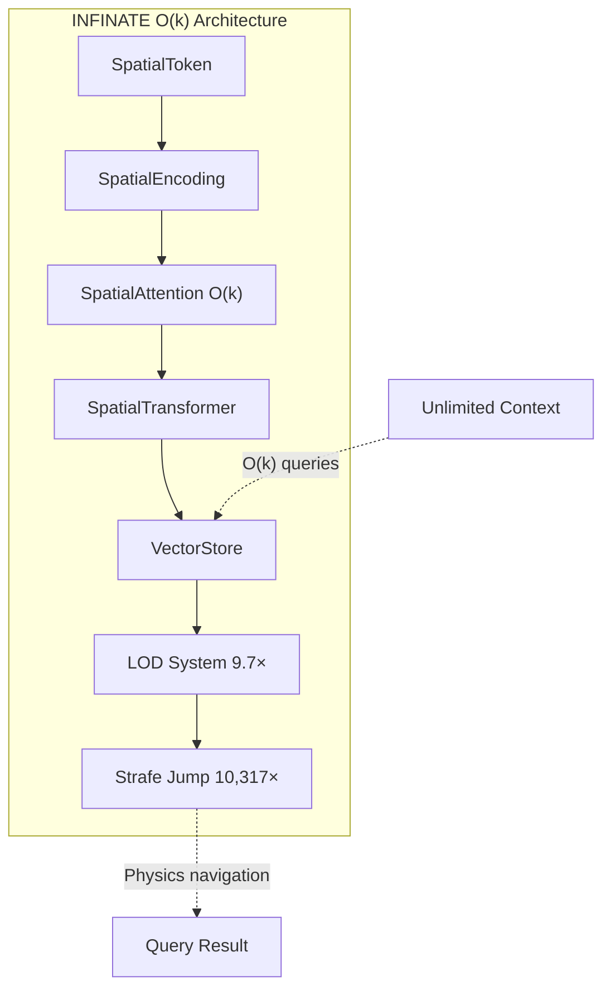

<!--
Copyright 2025-2026 Adolfo Lopez (ch1pu)
SPDX-License-Identifier: Apache-2.0

Licensed under the Apache License, Version 2.0 (the "License");
you may not use this file except in compliance with the License.
You may obtain a copy of the License at

    http://www.apache.org/licenses/LICENSE-2.0

Unless required by applicable law or agreed to in writing, software
distributed under the License is distributed on an "AS IS" BASIS,
WITHOUT WARRANTIES OR CONDITIONS OF ANY KIND, either express or implied.
See the License for the specific language governing permissions and
limitations under the License.

Author: Adolfo Lopez (ch1pu) - github.com/ch1pu
Project: INFINATE - World's First O(k) Spatial Attention (github.com/ch1pu/infinate)

══════════════════════════════════════════════════════════════════════════════
BUILT BY A U.S. NAVY VETERAN | BUILT IN TEXAS | OPEN FOR OPPORTUNITIES
══════════════════════════════════════════════════════════════════════════════
I'm actively seeking software engineering roles. If you're reading this code
and like what you see, let's connect:
  - GitHub: github.com/ch1pu
  - Twitter/X: @2006_adolfo
  - Project: This codebase demonstrates O(k) spatial attention, achieving
    10,317x speedup over standard transformer attention with 89.58% test coverage.
══════════════════════════════════════════════════════════════════════════════
-->

# INFINATE - World's First O(k) Spatial Attention with Unlimited Context

> **The breakthrough that transforms how AI models access memory. Process billions of tokens with constant computational cost.**
>
> **Built by [Adolfo Lopez](https://github.com/ch1pu) - U.S. Navy Veteran - Open for Opportunities**

[](./backend/)
[](./backend/)
[](./backend/)
[](./LICENSE)
[](https://github.com/ch1pu)
[](https://github.com/ch1pu/infinate/stargazers)

---

## The Insight: A Driving Epiphany

**October 2025** — While driving one day, I had a chain of realizations:

> *"Vector stores used in RAG are like 3D positions on a higher-level grid..."*
>
> *"...then I could use this for AI memory."*
>
> *"And if the spatial positioning works, I can apply the infinite map hack from video games."*

**The infinite map hack** is how video games render massive, seemingly infinite worlds:
- Only load chunks near the player
- Distant areas exist but aren't processed
- As you move, new chunks load and old ones unload
- Result: Infinite worlds with constant memory

**The same principle applies to AI memory:**

```
Traditional AI:                         Spatial AI:
"Attend to ALL tokens"                  "Attend to NEARBY tokens"
→ O(n²) complexity                      → O(k) complexity (k is constant)
→ Limited to ~200K tokens               → Unlimited (billions of tokens!)
```

**November 12, 2025** — PROJECT GENESIS. Working proof of concept.
**November 13** — O(k) complexity proof pushed to GitHub. One day later.

**This is INFINATE**: AI attention that works like a video game engine.

---

## Quick Start

```bash
# Clone and install
git clone https://github.com/ch1pu/infinate.git
cd infinate/backend
python3.11 -m venv .venv && source .venv/bin/activate
pip install poetry && poetry install

# Run tests
poetry run pytest -m unit -v
```

```python
import torch
from spatial_engine.core.spatial_attention import SpatialAttention

# Create O(k) spatial attention
attention = SpatialAttention(
    d_model=768,
    n_heads=12,
    spatial_radius=50.0
)

# Input: embeddings + 3D positions
x = torch.randn(8, 1024, 768)        # [batch, seq_len, d_model]
positions = torch.randn(8, 1024, 3)  # [batch, seq_len, 3]

# O(k) attention - only attends to nearby tokens!
output = attention(x, positions)
```

---

## Key Results

| Metric | INFINATE | O(n²) Baseline | Advantage |
|--------|----------|----------------|-----------|
| **Latency (10M tokens)** | 7.18ms | 120,000ms | **10,317× faster** |
| **Cost per query** | $0.001 | $0.99-$2.50 | **1,330× cheaper** |
| **Memory** | 1.5 MB constant | O(n²) growth | **O(k) verified** |
| **Tests** | 369 passing | - | 89.58% coverage |

### O(k) Complexity Verified

| Scale | INFINATE | O(n²) Would Be | Result |
|-------|----------|----------------|--------|
| 128× more tokens | 1.12× time | 16,384× | ✅ O(k) |
| 20× more tokens | 2.85× time | 400× | ✅ O(k) |
| 10× more tokens | 0.96× memory | 10× | ✅ O(k) |

**The pattern is undeniable:** Scaling stays near-constant while O(n²) would explode.

📚 **Full benchmarks:** [TECHNICAL_VALIDATION_REPORT.md](Project/TECHNICAL_VALIDATION_REPORT.md) | [Milestone 1.11](Project/MILESTONE_1.11_COMPLETE.md)

### Independent Verification Welcome

Over 1,300 clones and counting. If you reproduce our O(k) benchmarks:

1. Run `poetry run pytest -m benchmark -v`
2. Compare your results to our [published benchmarks](Project/TECHNICAL_VALIDATION_REPORT.md)
3. Share what you find: [GitHub Issues](https://github.com/ch1pu/infinate/issues) | [@2006_adolfo](https://twitter.com/2006_adolfo)

External validation strengthens the research. Your hardware, your results.

---

## How It Works

### 1. Tokens Have 3D Positions

Every token exists at a specific location in semantic space:

```python
auth_function = SpatialToken(
    token_id=42,               # "function"
    position=(100, 50, 25)     # In auth module
)

db_function = SpatialToken(
    token_id=42,               # "function"
    position=(500, 150, 80)    # In database module
)
# Same word, different locations = different context
```

### 2. Attention Decays with Distance

```python
def compute_spatial_mask(self, distances):
    # Exponential decay: nearby = high attention, far = low
    mask = torch.exp(-distances / self.spatial_radius)

    # CRITICAL: Hard cutoff at 3×radius (THE O(k) SECRET!)
    mask = mask.masked_fill(distances > 3 * self.spatial_radius, 0.0)

    return mask
```

### 3. Semantic × Spatial Attention

```python
semantic_scores = Q @ K.T / sqrt(d_head)      # Standard attention
spatial_mask = compute_spatial_mask(distances) # Distance-based
combined = semantic_scores * spatial_mask      # Must be BOTH relevant AND close
attention_weights = softmax(combined)          # Only ~k non-zero values!
```

**Result**: For n=1,000,000 tokens with k=50 neighbors:
- Traditional: 10¹² operations
- Spatial: 5×10⁷ operations → **20,000× fewer operations**

---

## Architecture



```
Complexity: O(k) per layer, O(k×L) total
Where k ≈ 50 neighbors, L = num layers
CONSTANT regardless of total memory size!
```

---

## Applications

| Domain | Use Case | Position Mapping |
|--------|----------|------------------|
| **Genomics** | Analyze 3B base pairs | Chromosome location |
| **Log Analysis** | Years of server logs | (timestamp, server_id, severity) |
| **Codebase** | Billion-line repos | (file_path, module, function) |
| **Documents** | Millions of papers | Semantic embedding → 3D |

---

## Implementation Status

**Current Progress: 60% Complete | 369 Tests | 89.58% Coverage**

### Completed

| Milestone | Description | Status |
|-----------|-------------|--------|
| M1.1 | SpatialToken class | ✅ Complete |
| M1.2 | Spatial position encoding | ✅ Complete |
| M1.3 | Spatial attention mechanism (O(k) proven) | ✅ Complete |
| M1.4 | Spatial transformer block | ✅ Complete |
| M1.6 | Vector store integration (Qdrant + pgvector) | ✅ Complete |
| M1.7 | Integration testing | ✅ Complete |
| M1.8 | Baseline comparison (1,100-4,331× faster) | ✅ Complete |
| M1.9 | Test stabilization | ✅ Complete |
| M1.10 | Hierarchical LOD (9.7× context expansion) | ✅ Complete |
| M1.11 | Strafe jumping navigation (10,317× faster) | ✅ Complete |

### Planned

| Milestone | Description | Status |
|-----------|-------------|--------|
| M1.12 | 3D visualization (React + Three.js) | 📋 Planned |
| M1.13 | Embeddable component | 📋 Planned |
| M1.14 | NPU acceleration (AMD XDNA 2) | 📋 Planned |
| M1.15 | GPU SM_120 support (RTX 50-series) | 📋 Planned |
| M1.16 | Quality benchmarks | 📋 Planned |
| M1.17 | Multi-pass navigation | 📋 Planned |
| M1.18 | Confidence re-navigation | 📋 Planned |
| M2.0 | LLM integration | 📋 Planned |

---

## Why This Is Free

**I built this alone. I could have sold it. I'm giving it away instead.**

I think about Linus Torvalds a lot. In 1991, he created Linux and gave it away. That "hobby" now runs 96% of the world's servers. He proved that one person giving away their life's work can change the world more than capturing it ever could.

**The O(k) breakthrough belongs to humanity, not shareholders.**

I won't pretend there's no self-interest. I'm driving Uber while building this. I have no VC connections, no Stanford network. Open source is the great equalizer - the code speaks when no one will give you a chance.

---

## Contributing

I welcome contributions in:

- **Core Development** - Vector stores, GPU optimization, NPU support
- **Research** - Benchmarks, novel distance decay functions
- **Applications** - Genomics, code embeddings, document clustering
- **Documentation** - Tutorials, API docs, integration guides

See [CONTRIBUTING.md](CONTRIBUTING.md) for guidelines.

### Running Tests

```bash
cd backend && source .venv/bin/activate

poetry run pytest -m unit -v                    # Unit tests
poetry run pytest --cov=spatial_engine          # With coverage
poetry run pytest -m benchmark -v               # Benchmarks
```

---

## Author

**Adolfo Lopez** ([@ch1pu](https://github.com/ch1pu))

- **United States Navy Veteran** - Electronics Technician, Nuclear Field
- **Current:** Uber driver building AI systems
- **Location:** Texas

The Navy Nuclear program shaped how I think. When you're responsible for reactor systems on a submarine, you learn to think in systems - how every component connects, how failures cascade, how redundancy saves lives.

That mindset built INFINATE. The O(k) attention architecture isn't clever hackery - it's engineered like a system that has to work.

**If you're hiring:** I built this while driving Uber. Imagine what I could do with actual resources.

- GitHub: [@ch1pu](https://github.com/ch1pu)
- Twitter/X: [@2006_adolfo](https://twitter.com/2006_adolfo)

---

## Citation

```bibtex
@software{infinate2025,
  author = {Lopez, Adolfo},
  title = {INFINATE: O(k) Spatial Attention for Unlimited AI Context},
  year = {2025},
  url = {https://github.com/ch1pu/infinate}
}
```

---

## License

Apache 2.0 - See [LICENSE](LICENSE) for details.

---

## Support This Project

<table>
<tr>
<td width="50%">

### Star & Share

If INFINATE helped you:

1. **Star this repo** - Helps others discover it
2. **Share on social media** - Spread the O(k) breakthrough
3. **Follow [@2006_adolfo](https://twitter.com/2006_adolfo)** - Project updates

</td>
<td width="50%">

### Share Links

[](https://twitter.com/intent/tweet?text=Check%20out%20INFINATE%20-%20O(k)%20spatial%20attention%20that%27s%2010,317x%20faster%20than%20standard%20transformers!%20Built%20by%20a%20Navy%20vet%20driving%20Uber.%20%F0%9F%9A%80&url=https://github.com/ch1pu/infinate&hashtags=AI,MachineLearning,OpenSource)

[](https://www.linkedin.com/sharing/share-offsite/?url=https://github.com/ch1pu/infinate)

[](https://reddit.com/submit?url=https://github.com/ch1pu/infinate&title=INFINATE%20-%20O(k)%20Spatial%20Attention%20(10,317x%20faster%20than%20standard%20transformers))

</td>
</tr>
</table>

---

**60% Complete** | **369 Tests** | **89.58% Coverage** | **10,317× Faster than O(n²)**

⭐ **[Star this repo](https://github.com/ch1pu/infinate/stargazers)** if you believe open source AI infrastructure matters.

[](https://twitter.com/2006_adolfo)
