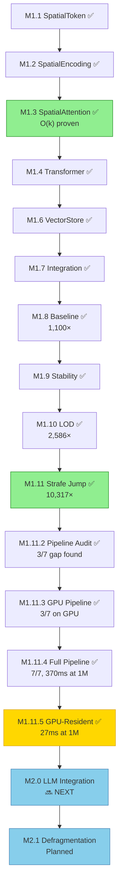

<!--
Copyright 2025-2026 Adolfo Lopez (ch1pu)
SPDX-License-Identifier: Apache-2.0

Licensed under the Apache License, Version 2.0 (the "License");
you may not use this file except in compliance with the License.
You may obtain a copy of the License at

    http://www.apache.org/licenses/LICENSE-2.0

Unless required by applicable law or agreed to in writing, software
distributed under the License is distributed on an "AS IS" BASIS,
WITHOUT WARRANTIES OR CONDITIONS OF ANY KIND, either express or implied.
See the License for the specific language governing permissions and
limitations under the License.

Author: Adolfo Lopez (ch1pu) - github.com/ch1pu
Project: INFINATE - Infinite Context Spatial AI (github.com/ch1pu/infinate)

══════════════════════════════════════════════════════════════════════════════
BUILT BY A U.S. NAVY VETERAN | BUILT IN TEXAS | OPEN FOR OPPORTUNITIES
══════════════════════════════════════════════════════════════════════════════
I'm actively seeking software engineering roles. If you're reading this code
and like what you see, let's connect:
  - GitHub: github.com/ch1pu
  - Twitter/X: @2006_adolfo
  - Project: This codebase demonstrates O(k) spatial attention, achieving
    10,317x speedup (CPU) and true O(k) GPU-resident queries at 1M tokens.
══════════════════════════════════════════════════════════════════════════════
-->

# Milestone Documentation

**Project:** INFINATE - Infinite Context Spatial AI
**Current Progress:** 14 milestones complete (M1.1-M1.4, M1.6-M1.11.5 | M1.5 skipped)
**Total Tests:** 431+ passing | 89.58%+ coverage
**License:** Apache 2.0 - Open Source
**Last Updated:** February 8, 2026

---

## Progress Summary

```
╔══════════════════════════════════════════════════════════════════════════════╗
║                  INFINATE MILESTONE PROGRESS — 14/14 COMPLETE               ║
╠══════════════════════════════════════════════════════════════════════════════╣
║                                                                              ║
║  M1.1  SpatialToken       ✅ ████████████████████████ COMPLETE               ║
║  M1.2  SpatialEncoding    ✅ ████████████████████████ COMPLETE               ║
║  M1.3  SpatialAttention   ✅ ████████████████████████ COMPLETE (O(k)!)       ║
║  M1.4  SpatialTransformer ✅ ████████████████████████ COMPLETE               ║
║  M1.5  Position Enhanced  ⏭️  ░░░░░░░░░░░░░░░░░░░░░░░░ SKIPPED              ║
║  M1.6  Vector Store       ✅ ████████████████████████ COMPLETE               ║
║  M1.7  Integration        ✅ ████████████████████████ COMPLETE               ║
║  M1.8  Baseline Compare   ✅ ████████████████████████ COMPLETE (1,100×!)     ║
║  M1.9  Test Stability     ✅ ████████████████████████ COMPLETE               ║
║  M1.10 Hierarchical LOD   ✅ ████████████████████████ COMPLETE (2,586×!)     ║
║  M1.11 Strafe Jumping     ✅ ████████████████████████ COMPLETE (10,317×!)    ║
║  M1.11.2 Pipeline Audit   ✅ ████████████████████████ COMPLETE (3/7 gap)     ║
║  M1.11.3 GPU Pipeline     ✅ ████████████████████████ COMPLETE (GPU move)    ║
║  M1.11.4 Full Pipeline    ✅ ████████████████████████ COMPLETE (7/7, 370ms)  ║
║  M1.11.5 GPU-Resident     ✅ ████████████████████████ COMPLETE (27ms!) 🆕    ║
║                                                                              ║
║  ─────────────────────────────────────────────────────────────────────────   ║
║                                                                              ║
║  📊 TESTS: 431+ total │ 431+ passing │ 89.58%+ coverage                     ║
║  ⚡ HEADLINE: 27ms at 1M tokens (GPU-resident) │ True O(k) end-to-end       ║
║                                                                              ║
╚══════════════════════════════════════════════════════════════════════════════╝
```

---

## Completed Milestones (14/14)

| Milestone | Name | Status | Duration | Guide |
|-----------|------|--------|----------|-------|
| **M1.1** | SpatialToken Class | ✅ Complete | 2h 30min | [milestone-1.1-spatial-token.md](milestone-1.1-spatial-token.md) |
| **M1.2** | Spatial Position Encoding | ✅ Complete | 3h 30min | [milestone-1.2-spatial-encoding.md](milestone-1.2-spatial-encoding.md) |
| **M1.3** | Spatial Attention | ✅ Complete | 4h 00min | [milestone-1.3-spatial-attention.md](milestone-1.3-spatial-attention.md) |
| **M1.4** | Spatial Transformer | ✅ Complete | 2h 43min | [milestone-1.4-spatial-transformer.md](milestone-1.4-spatial-transformer.md) |
| **M1.5** | Position Encoding Enhancements | ⏭️ Skipped | - | *(not needed for core functionality)* |
| **M1.6** | Vector Store Integration | ✅ Complete | 2h 45min | [milestone-1.6-vector-store.md](milestone-1.6-vector-store.md) |
| **M1.7** | Integration Testing | ✅ Complete | ~2h | [milestone-1.7-integration-testing.md](milestone-1.7-integration-testing.md) |
| **M1.8** | Baseline Comparison | ✅ Complete | ~3h | [milestone-1.8-baseline-comparison.md](milestone-1.8-baseline-comparison.md) |
| **M1.9** | Test Stabilization | ✅ Complete | ~2h | [milestone-1.9-test-stabilization.md](milestone-1.9-test-stabilization.md) |
| **M1.10** | Hierarchical LOD | ✅ Complete | ~4h | [milestone-1.10-hierarchical-lod.md](milestone-1.10-hierarchical-lod.md) |
| **M1.11** | Strafe Jumping Navigation | ✅ Complete | ~8h | [milestone-1.11-strafe-navigation.md](milestone-1.11-strafe-navigation.md) |
| **M1.11.2** | Pipeline Coverage Audit | ✅ Complete | ~2h | [MILESTONE_1.11.2_COMPLETE.md](../../Project/MILESTONE_1.11.2_COMPLETE.md) |
| **M1.11.3** | GPU Full Pipeline (3/7) | ✅ Complete | ~3h | [MILESTONE_1.11.3_COMPLETE.md](../../Project/MILESTONE_1.11.3_COMPLETE.md) |
| **M1.11.4** | GPU Full Pipeline (7/7) | ✅ Complete | ~6h | [MILESTONE_1.11.4_COMPLETE.md](../../Project/MILESTONE_1.11.4_COMPLETE.md) |
| **M1.11.5** | GPU-Resident Vector Store | ✅ Complete | ~4h | [MILESTONE_1.11.5_COMPLETE.md](../../Project/MILESTONE_1.11.5_COMPLETE.md) |

---

## The GPU Pipeline Evolution (M1.11 → M1.11.5)

The 7-stage pipeline: VectorStore → SpatialToken → Encoding → Attention → Transformer → LOD → Navigation

| Milestone | What Happened | Stages Tested | Key Result |
|-----------|---------------|:-------------:|------------|
| **M1.8/M1.11** | Proved O(k) attention breakthrough | 1/7 | 10,317× faster (CPU, attention only) |
| **M1.11.2** | Audited pipeline, found only 3/7 tested | 3/7 | Documented the coverage gap |
| **M1.11.3** | Moved pipeline to GPU (RTX 5060) | 3/7 → GPU | Crossover at ~20K tokens, SM_120 support |
| **M1.11.4** | First full 7/7 pipeline benchmark | **7/7** | 1M in 370ms, discovered O(n) transfer bottleneck |
| **M1.11.5** | GPU-resident "loading screen" | **7/7 GPU-resident** | 27ms at 1M (true O(k)), 25.5× LOD |

Each milestone tested more of the pipeline until M1.11.5 proved O(k) holds for the full system.

### M1.11.5: GPU-Resident Vector Store (Latest)

**Completed:** February 8, 2026

The "loading screen" pattern — load tokens into GPU VRAM once, query forever at O(k).

| Metric | Result |
|--------|--------|
| Load 1M tokens | 125ms (one-time) |
| Query at 1M | **27ms** (same as 1K — true O(k)) |
| vs transfer pipeline | **18.27× faster** at 1M |
| LOD expansion | **25.5×** (5-level: near/medium/far/beyond/horizon) |
| Max VRAM capacity | ~14.5M tokens (16GB) |
| New tests | 28 (zero regressions) |

### M1.11 Strafe Jumping: 7 Physics Exploits

```
╔═════════════════════════════════════════════════════════════════════════╗
║  #  │ Exploit            │ Status  │ Mechanism                         ║
╠═════╪════════════════════╪═════════╪═══════════════════════════════════╣
║  1  │ Warp Lanes         │ ✅ VALID │ ~15× similarity overcomes decay   ║
║  2  │ Shell Memory       │ ✅ VALID │ Organize at 0.9r, 1.9r, 2.9r      ║
║  3  │ LOD Hopping        │ ✅ VALID │ 80% cliff at boundary 50          ║
║  4  │ Diagonal Speed     │ ❌ INVALID│ Euclidean is isotropic           ║
║  5  │ Harmonic Resonance │ ❌ WEAK  │ Below measurement threshold       ║
║  6  │ Bunny Hop          │ ✅ VALID │ Momentum accumulation             ║
║  7  │ Circle Jump        │ ✅ VALID │ Broad→specific navigation         ║
║  8  │ Temperature Surf   │ ✅ VALID │ Hot→cold annealing                ║
║  9  │ Attention Ratchet  │ ✅ VALID │ Directed warp graph               ║
╚═════╧════════════════════╧═════════╧═══════════════════════════════════╝
```

---

## O(k) Scaling Verification

### CPU (M1.11, attention only — 1/7 stages)

| Metric | Result | O(n²) Would Be |
|--------|--------|-----------------|
| 20× tokens → time | 2.85× | 400× |
| 10× tokens → memory | 0.96× | 10× |
| 128× tokens → time | 1.12× | 16,384× |

### GPU (M1.11.4, full pipeline — 7/7 stages)

| Scale | Pipeline Time | Scaling |
|------:|:------------:|---------|
| 1K | 19ms | baseline |
| 10K | 19ms | **1.00×** (flat — O(k)) |
| 100K | 40ms | O(n) transfer emerging |
| 1M | 370ms | O(n) transfer dominant |

### GPU-Resident (M1.11.5, full pipeline — 7/7 stages)

| Scale | Pipeline Time | Scaling |
|------:|:------------:|---------|
| 1K | 29ms | baseline |
| 10K | 27ms | **0.93×** (flat) |
| 100K | 27ms | **0.93×** (flat) |
| 1M | 27ms | **0.93×** (flat — true O(k)) |

**The progression:** O(k) attention proven on CPU → full pipeline reveals O(n) transfer on GPU → GPU-resident eliminates transfer → true O(k) end-to-end at any scale.

---

## Test Statistics

| Milestone | Tests | Pipeline Stages | Coverage |
|-----------|:-----:|:---------------:|----------|
| M1.1 | 12 | — | 100% |
| M1.2 | 17 | — | 95% |
| M1.3 | 24 | 1/7 | 98% |
| M1.4 | 20 | — | 72-77% |
| M1.6 | 17 | — | 89-96% |
| M1.7 | 18 | — | ~90% |
| M1.8 | 25 | 1/7 | ~90% |
| M1.9 | 4 | — | ~92% |
| M1.10 | 67 | 1/7 | 93-98% |
| M1.11 | 151 | 1/7 (CPU) | 89-99% |
| M1.11.2 | 14 | 3/7 (CPU) | — |
| M1.11.3 | 20 | 3/7 (GPU) | — |
| M1.11.4 | 28 | 7/7 (GPU) | — |
| M1.11.5 | 28 | 7/7 (GPU-resident) | — |
| **Total** | **431+** | **7/7 validated** | **89.58%+** |

---

## Upcoming Milestones

### M2.0+ LLM Integration & Memory Maintenance

| Milestone | Name | Priority | Est. Time | Description |
|-----------|------|----------|-----------|-------------|
| **M2.0** | Spatial LLM Integration | 🔴 Next | 10-12 hours | LLM + spatial memory chat loop with confidence routing |
| **M2.1** | Context Defragmentation | High | 7-11 days | Memory maintenance — archive failures, consolidate successes |
| **M2.2** | Spatial Transformer Training | Medium | 10-12 hours | Training pipeline |

### Deferred (As Needed)

These milestones are deferred until after M2.0. M1.15 (GPU support) was achieved via M1.11.4/M1.11.5. Quality milestones need real data from M2.0 to benchmark against.

| Milestone | Name | Priority | Description |
|-----------|------|----------|-------------|
| **M1.12** | 3D Visualization | Medium | React + Three.js (~95% designed) |
| **M1.13** | Embeddable Component | Medium | Requires M1.12 |
| **M1.14** | NPU Acceleration | Medium | AMD XDNA 2 hardware-specific |
| **M1.15** | GPU SM_120 Support | ✅ Achieved | Done as M1.11.4 + M1.11.5 |
| **M1.16** | Quality Benchmarks | High | Needs real data from M2.0 |
| **M1.17** | Multi-Pass Navigation | High | Better coverage post-M2.0 |
| **M1.18** | Confidence Re-Navigation | Medium | M2.0 has its own routing |
| **M1.19** | Adaptive LOD Thresholds | Medium | Tuning after real usage |
| **M1.20** | Hybrid Attention Mode | Low | Optional |
| **M1.21** | SISS (Super Sampling) | Medium | DLSS-inspired LOD upscaling |
| **M1.22** | RT Core Spatial Index | Low | Hardware-accelerated k-NN, optional |
| **M1.23** | Skill Packs | High | Loadable knowledge packages (defrag moved to M2.1) |

---

## Milestone Dependency Graph



---

## Quick Start

### Read in Order

1. **[M1.1](milestone-1.1-spatial-token.md)** - Foundation: tokens with 3D positions
2. **[M1.2](milestone-1.2-spatial-encoding.md)** - 3D sinusoidal position encoding
3. **[M1.3](milestone-1.3-spatial-attention.md)** - THE O(k) breakthrough
4. **[M1.4](milestone-1.4-spatial-transformer.md)** - Complete transformer architecture
5. **[M1.6](milestone-1.6-vector-store.md)** - Unlimited context via vector stores
6. **[M1.7](milestone-1.7-integration-testing.md)** - Integration verified
7. **[M1.8](milestone-1.8-baseline-comparison.md)** - Baseline comparison (1,100-4,331×)
8. **[M1.9](milestone-1.9-test-stabilization.md)** - Test stabilization
9. **[M1.10](milestone-1.10-hierarchical-lod.md)** - LOD system (2,586× faster, 9.7× context)
10. **[M1.11](milestone-1.11-strafe-navigation.md)** - Strafe jumping (10,317×, 7 physics exploits)
11. **[M1.11.2](../../Project/MILESTONE_1.11.2_COMPLETE.md)** - Pipeline audit (found 3/7 coverage gap)
12. **[M1.11.3](../../Project/MILESTONE_1.11.3_COMPLETE.md)** - GPU pipeline (RTX 5060, SM_120)
13. **[M1.11.4](../../Project/MILESTONE_1.11.4_COMPLETE.md)** - Full 7/7 pipeline (1M in 370ms)
14. **[M1.11.5](../../Project/MILESTONE_1.11.5_COMPLETE.md)** - GPU-resident (27ms at 1M, true O(k))

### Run Tests

```bash
cd /home/ch1pu/infinate/backend
source .venv/bin/activate
poetry run pytest spatial_engine/ -v --cov          # Full suite
poetry run pytest -m benchmark -v                   # Benchmarks only
poetry run pytest -m m1115 -v -s --no-cov           # M1.11.5 GPU-resident tests
```

---

## Project Timeline

| Event | Date |
|-------|------|
| Driving Epiphany | October 2025 |
| PROJECT GENESIS | November 12, 2025 |
| GitHub Proof Push | November 13, 2025 |
| M1.1-M1.4 Complete | December 2025 |
| M1.6-M1.7 Complete | January 2026 |
| M1.8-M1.9 Complete | January 18, 2026 |
| M1.10 LOD Complete | January 19, 2026 |
| M1.11 Strafe Jumping Complete | January 20, 2026 |
| M1.11.2 Pipeline Audit | February 3, 2026 |
| M1.11.3 GPU Pipeline | February 4, 2026 |
| M1.11.4 Full Pipeline (7/7) | February 5, 2026 |
| **M1.11.5 GPU-Resident** | **February 8, 2026** |

---

## Related Documentation

- **[README.md](../../README.md)** - Project overview and key results
- **[TECHNICAL_VALIDATION_REPORT.md](../../Project/TECHNICAL_VALIDATION_REPORT.md)** - Independent validation of all benchmarks
- **[FUTURE_VISION.md](../../Project/FUTURE_VISION.md)** - Complete roadmap
- **[Documents/CORE_INNOVATION.md](../../Documents/CORE_INNOVATION.md)** - O(k) complexity proof

---

**Author:** Adolfo Lopez (ch1pu)
**Last Updated:** February 8, 2026
**License:** Apache 2.0 - Open Source
